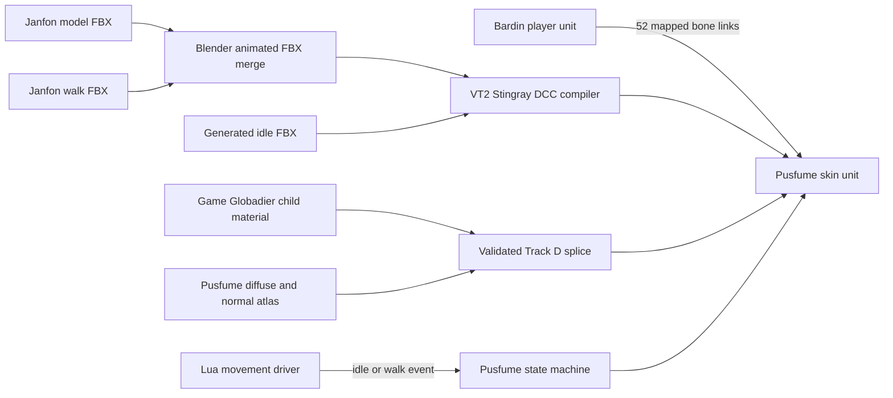

# Native Character Milestone

## Status

Reached on 2026-07-16 in the friends-only Workshop prototype.

| Evidence | Value |
| --- | --- |
| Branch | `feat/6-integrate-native-unit` |
| Milestone commit | `0ffdf5a` |
| Workshop item | `3764954245` |
| Confirmed manifest | `2405082174877027150` |
| Manifest timestamp in game | `7/16/2026 6:45:43 PM` |
| Python regression suite | 23 passing tests |
| Source preflight | Passing |
| Runtime preflight | 15 pass, 6 expected warnings, 0 fail |

This milestone establishes that VT2 can render and deform Janfon's custom
third-person Pusfume mesh with its reconstructed textures in the hero preview
and in game. The model has a visible generated idle, transitions to Janfon's
walk cycle, and no longer inherits the Globadier's green emissive glow.

This is the first proven native-character baseline. It is not a finished
career or final art release.

## Confirmed behavior

- Pusfume registers as Bardin career index 5 while Ranger Veteran supplies
  temporary gameplay, backend, talent, loadout, ability, and bot adapters.
- A full-size, clickable Pusfume card occupies the unused virtual UI position
  above Saltzpyre without resizing the existing five hero rows.
- The hero selector and in-game third-person attachment render Janfon's
  13,100-vertex, 24,318-triangle placeholder mesh.
- The complete opaque mesh uses the reconstructed Pusfume atlas rather than
  Globadier color textures.
- The game evaluates the 82-bone skin and visibly deforms the mesh.
- The controller exposes `idle` and `walk`; runtime movement drives the
  transition with speed hysteresis.
- The generated idle moves the spine, neck, head, and tail. Janfon's 25-frame
  baked walk cycle plays while moving.
- The donor material package and child package load and release without a
  Pusfume Lua error.
- The friends-only Workshop build is reproducible from private handoff files
  plus the installed VT2 game and SDK.

## Architecture



The visible character is a compiled skin attachment, not a replacement player
unit. Bardin remains the authoritative gameplay unit. `_pusfume_assets.lua`
maps 52 parent nodes to Janfon's slave-rat-derived hierarchy, and
`World.link_unit` drives the child nodes from the player.

This split is consistent with VT2's playable Dark Pact characters: an animated
base owns gameplay and animation state, while a linked skin unit owns visible
geometry.

## Asset and compiler path

The private July 2026 handoff contains:

- `pusfume_3p.fbx`: skinned third-person model.
- `pusfume_3p_walk.fbx`: baked 30 FPS walk cycle.
- `psf_unit.blend`: Blender source.
- 23 texture maps in mixed source roles.

The current model has 82 bones, 77 vertex groups, nine material slots, one UV
layer, and no unweighted vertices. The build prunes 24 five-influence vertices
to VT2's four-influence limit and normalizes their weights.

`prepare_animated_pusfume_fbx.py` imports the model and walk FBXs into Blender,
transfers the walk action to the skinned armature, remaps opaque UV loops into
the generated atlas, and exports one animated character FBX. The tool rejects
the result unless both pose bones and evaluated mesh vertices move.

Fatshark's supported DCC importer compiles that merged FBX through a same-name
`.dcc_asset` and `.unit`. This was the decisive animation fix. A static model
plus an independently compiled animation could advance its playhead while the
mesh remained rigid because the compiled unit lacked the correct animated
character activation group.

The handwritten BSI exporter remains useful for format diagnostics, but it is
not the successful live skinning path.

## Animation contract

The native unit contains a same-name `.bones` resource and points at
`units/pusfume/pusfume_3p.state_machine`. The controller currently has one
layer and two states:

| Event/state | Clip | Source | Behavior |
| --- | --- | --- | --- |
| `idle` / `base/idle` | `pusfume_3p_idle` | Generated locally | Two-second loop with breathing, head movement, and tail sway |
| `walk` / `base/walk` | `pusfume_3p_walk` | Janfon handoff | 25 frames at 30 FPS, 0.8-second loop |

Runtime attachment setup:

1. Selects animation bone LOD 0.
2. Enables the unit state machine.
3. Uses transform-capable animation bone mode.
4. Explicitly enters `idle` rather than relying on implicit default-state
   activation.
5. Measures horizontal player speed from frame-to-frame position changes.
6. Fires `walk` above 0.5 m/s and `idle` below 0.2 m/s.

The two thresholds provide hysteresis and prevent rapid state flapping.
Transitions blend over 0.25 seconds.

The latest confirmed runtime log records the controller, both locomotion
events, changing controller state, source-bone motion, target-bone motion, and
nonzero articulation. Visual testing confirms the animation is visible, not
merely advancing internally.

## Material breakthrough

The animation and texture problems were coupled through shader selection.
Mod-SDK-compiled standard materials rendered Pusfume's textures but did not
select a complete character-skinning shader permutation. Assigning the game's
Globadier material enabled deformation but initially rendered Globadier maps.

Runtime texture APIs did not solve this. `Material.set_texture` and
`Unit.set_texture_for_materials` reported success, but a game-owned character
material retained texture bindings from its own bundle context.

The successful Track D path therefore:

1. Compiles a temporary child material so the mod bundle has the correct
   resource identity and package references.
2. Renames the compile-only stub parent so runtime inheritance resolves against
   the installed game's real character material.
3. Extracts the installed Globadier `mtr_outfit` child locally.
4. Replaces the temporary child's payload inside the generated mod bundle with
   the game's 768-byte child binding payload.
5. Patches only the proven texture resource IDs and one reflected material
   variable.
6. Validates bundle sizes, resource identity, texture channels, variable shape,
   and payload round-trip before deployment.

The final texture table is:

| Compiled channel | Meaning | Final resource |
| --- | --- | --- |
| `texture_map_02af90f8` | Diffuse | Pusfume atlas `C263ECB79A8DCEC0` |
| `texture_map_27b67fd2` | Emissive | Donor black map `45FFAEEF53695A86` |
| `texture_map_8bf37d8e` | Normal plus gloss in alpha | Pusfume atlas `A4215592F6297E57` |

The original Track D test incorrectly treated the second channel as normal and
the third as a packed response map. That fed a normal map into emissive and
made the entire model glow. Decoding the donor textures established the actual
semantics above.

After correcting those channels, only dark areas retained a green underglow.
The copied child variable hash `C985395A` resolves to `emissive_color` and held
the Globadier-specific value `[14.2, 25.3, 2]`. Track D-E sets this reflected
vector to `[0,0,0]`. It does not alter the working shader parent, black emissive
texture, diffuse atlas, normal atlas, or animation data.

## Atlas reconstruction

One game child material is assigned to all eight opaque Pusfume material slots,
so those slots cannot retain independent texture values. The build creates a
single 4096-square atlas and remaps each opaque FBX region into it.

The atlas manifest keeps these source roles distinct:

- `p_main`: Pusfume skin diffuse plus Skaven body normal/specular sources.
- `p_glob`: Globadier outfit sources.
- `p_armor`: Stormvermin outfit sources.
- `p_metal`: Skaven weapon-set sources.
- `p_ammo_box_limited_a`: generic dirty-cloth sources.
- `p_ammo_box_limited_b`: limited ammo-box sources.
- Eye regions: authored color with neutral missing channels.
- Whiskers: separate alpha-cutout material, not part of the opaque child swap.

The layout uses guard insets and repeated edge tiles for wrapped UV regions.
The audit covers all 24,318 triangles and reports zero escaped UV loops. The
opaque diffuse atlas is fully opaque; only whiskers retain diffuse alpha.

## Rejected approaches

Do not repeat these experiments without new evidence.

| Approach | Observed result | Conclusion |
| --- | --- | --- |
| Static FBX plus separate clip | Clip/controller advanced, mesh stayed rigid | Character FBX must compile with the animated activation group |
| Handwritten BSI as the final unit | Valid geometry/skin data, no proven live deformation | Keep as a diagnostic fallback |
| Generic SDK standard material | Pusfume textures, rigid mesh | Valid rendering is not proof of a character-skinning permutation |
| Embedded standard-base graph | Pusfume textures, rigid mesh | Copying a graph did not reproduce the game character binding |
| Runtime texture override | API reported success, rendered maps unchanged | Character material bindings remain bundle-context-bound |
| Early or late duplicate texture IDs | Globadier textures still won | Resource registration order does not rebind this material |
| SDK child against compile stub | Child loaded, but rigid/dark | Compile-time binding remained tied to the stub |
| Normal atlas in channel `27b67fd2` | Whole model glowed | Channel is emissive, not normal |
| Globadier child `emissive_color` unchanged | Green underglow in dark areas | Donor effect variables must be neutralized deliberately |
| Probing an assumed animation layer | Engine assertion/crash | Do not call experimental layer APIs without proven indices |

## Reproduction

### Prerequisites

- VT2 and the Vermintide 2 SDK installed through Steam.
- Blender 5.2 at the configured path.
- `vt2_bundle_unpacker` built locally.
- The private Pusfume FBX and texture handoff under `.build/pusfume_handoff`.
- VMB and VMBLauncher configured for `.build/native-workshop`.

The private handoff and extracted game resources are intentionally absent from
Git. A clean public clone cannot produce the native candidate without them.

### Verification and build

```powershell
py -m unittest discover -s tests -v
.\tools\Test-PusfumeSource.ps1
.\tools\Build-NativePusfume.ps1 -HeroPreview -SplicedGameChild
```

The build must report:

- Animated FBX pose and evaluated-vertex movement.
- Successful VT2 SDK compilation.
- Stub parent identity removed.
- One 768-byte child payload spliced into exactly one bundle.
- Diffuse, emissive, and normal channels verified by name.
- `emissive_color` set to `[0,0,0]` with vector shape validated.
- Seven Workshop files deployed and SHA-256 verified.

### Upload and manifest verification

```powershell
& "<VMBLauncher.exe>" upload pusfume `
  --config .build/vmb-pusfume-settings.json `
  --no-banner
```

Do not trust the uploader's final message alone. Confirm that
`Steam/logs/workshop_log.txt` contains a fresh `Uploaded new content` line and
record its ManifestID. A full Steam restart may be required before a
self-authored item reports the new `last_updated` timestamp in the game log.

For Manifest `2405082174877027150`, the expected in-game timestamp is
`7/16/2026 6:45:43 PM`.

## Diagnostics

- `/pusfume_preflight`: registration, backend, package, UI, and spawn checks.
- `/pusfume_status`: active career and selector-hook state.
- `/pusfume_material_probe`: donor/child/split material experiments.
- `/pusfume_tint`: retained shader-tint diagnostic; not required by the
  confirmed Track D-E baseline.
- Console lines beginning `[MOD][pusfume]`: authoritative runtime evidence.

The native animation probe logs controller state, bone mode, source and target
motion, link error, and articulation at 0.5, 2, and 5 seconds. These diagnostics
must remain available until remote-husk and full locomotion coverage are done.

## Provenance and publication boundary

The public Git repository does not contain the private model handoff, extracted
VT2 textures, the raw game material, or generated native bundles.

The current friends-only Workshop candidate does contain compiled output from
the placeholder model and textures, and its generated bundle embeds the
locally extracted 768-byte game material binding payload. Saying that the raw
payload "never leaves `.build`" is insufficient: its bytes are incorporated
into the deployed bundle. This must receive explicit provenance and release
review before visibility is expanded beyond friends-only.

The final public path should prefer original or clearly redistributable art and
should replace copied game payloads where a lawful source-authored equivalent
can reproduce the required character shader binding.

## Current limitations

- Only idle and walk are animated. Run/sprint, crouch, jump/fall, dodge,
  attacks, ability actions, ledge states, downed, death, and weapon poses need
  authored or safely retargeted clips.
- The placeholder armature and mesh still need Janfon's planned overhaul.
- First-person arms are not implemented.
- Pusfume still borrows Ranger Veteran gameplay, talents, ability, inventory,
  and persistence.
- Bardin's donor weapon bodies are hidden rather than integrated with custom
  Pusfume hand poses.
- Adventure is the only supported mechanism. Chaos Wastes, Weaves, Versus,
  and Official Realm remain intentionally blocked.
- Remote client/husk deformation and full multiplayer synchronization still
  require dedicated testing.
- The raw placeholder art is not approved for a public Git or Workshop release.

## Next priorities

1. Preserve this manifest as the known-good visual baseline.
2. Add authored run, jump/fall, and dodge clips on the exact 82-bone rig.
3. Extend the state machine from speed-only locomotion to grounded, airborne,
   dodge, crouch, weapon, and action states.
4. Test a host and remote client with identical builds, including death,
   rescue, bot takeover, and reconnect.
5. Request separate first-person arms and weapon hand poses after third-person
   locomotion is stable.
6. Replace Ranger Veteran backend persistence with Pusfume-specific local data.
7. Complete provenance review before changing Workshop visibility.

## Code map

- `tools/Build-NativePusfume.ps1`: canonical private native build and deploy.
- `tools/prepare_animated_pusfume_fbx.py`: model, animation, and atlas merge.
- `tools/generate_idle_pusfume_fbx.py`: deterministic placeholder idle.
- `tools/make_spliced_child.py`: texture and reflected-variable material patch.
- `tools/splice_bundle_resource.py`: size-aware bundle payload replacement.
- `tools/pusfume_atlas_layout.json`: atlas source and tile contract.
- `pusfume/scripts/mods/pusfume/_pusfume_native.lua`: attachment, material,
  controller, movement driver, and diagnostics.
- `pusfume/scripts/mods/pusfume/_pusfume_assets.lua`: parent-child bone bridge.
- `docs/COLLAB_STATUS.md`: chronological experiment log.
- `docs/MODEL_HANDOFF.md`: art and skeleton handoff details.
- `docs/LIVE_TEST_CHECKLIST.md`: repeatable in-game acceptance pass.
